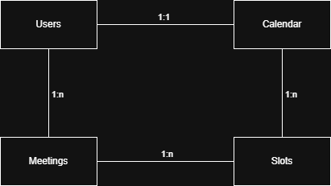
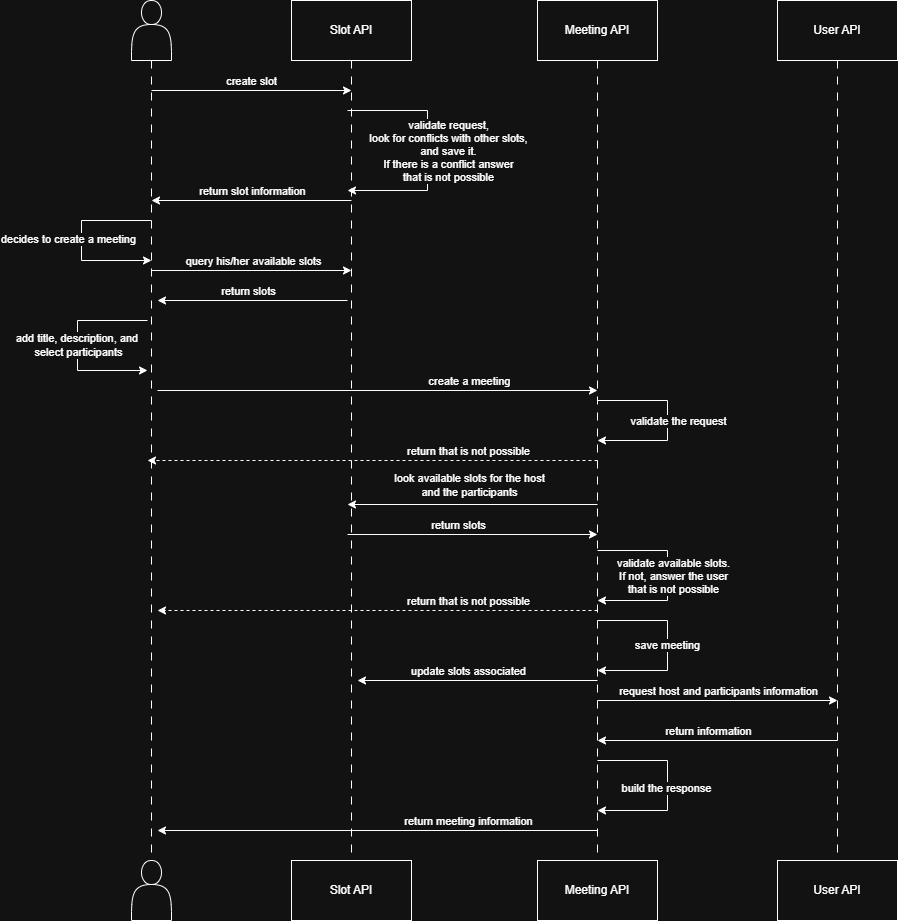
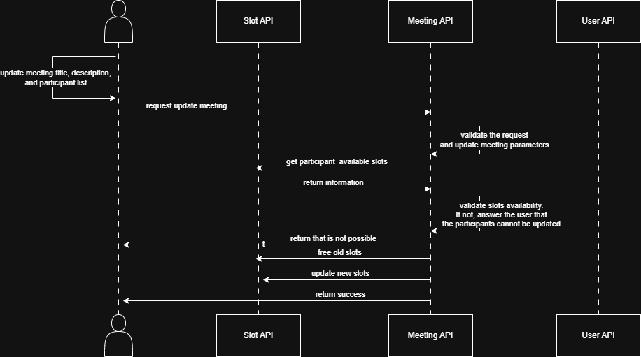

# Calendar

## Project Overview
This project is a Spring Boot application that provides an API for a checkout system.

## Architecture
This project follows a monolithic architecture and is built using the following technologies:
- **Java 25**
- **Spring Boot 4.0.6**
- **Gradle 9.5.1**
- **Docker**
- **PostgreSQL 17-trixie** (as database image)
- **Prometheus v3.11.3** (as metrics collection)
- **Grafana 11.6.14** (as data visualization for the metrics)

## Design
I started identifying the objective of the problem (a prototype calendar) and the ACs:
- **Create slots**.
- **Query slots**: by ID, or time range and status.
- **Update slots**:
  - Update the time range.
  - Assign a meeting and updated to **BUSY** and with a **ROLE** (**HOST** or **INVITEE**) in this meeting.
  - As this wasn't all clear besides the meeting creation via a **slot**, I decided that a slot can be updated directly as **BUSY** (no **meeting** linked to it).
- **Delete slots**.
- **Create meetings from slots**.
- **Query meetings**: by ID.
- **Update meetings**:
  - Update the title.
  - Update the description.
  - Update the participants. For this one I decided to update the slots of all participants (free them) and update the slots of new participants (assign them as **BUSY**).

Some other features were not in the ACs but were added as features:
- **Create users**: create an associated calendar.
- **Query users**: by ID or by email (this is unique).
- **Update users**: update their associated calendar if necessary (timezone).
- **Delete users**: inactivate them, as well their associated calendars.
- **Query calendar**: by ID.
- **Update calendar**: just the timezone.

### Database
For the DB I decided to focus more in the queries than in the inserts. 
Although the slots and meetings was the critical point, I decided normalize the DB and separate the entities for scalability.

Additionally, even if Calendar was not necessary as a separate entity (could be inside Users), 
I decided to separate it for the same reason, then maybe an user can have several calendars with different timezones, 
but also this can be done in a different way. So as this was not the main focus, I didn't think too much about the idea.<br>



### Workflow
I started implementing the integration tests and some unit tests. Meanwhile implementing the logic these tests were being updated or new ones were added.

The idea is to get a clear image of the workflow to create an user, and with him/her add slots or create meetings from those.

For this reason I created a fifth script using Flyaway dependency to fill the database with data of users and free slots.

This is an example of the main workflow to create a meeting:



This is an example of the workflow to update a meeting:



There are similar workflows for the slots, not as complex, but with similar features to avoid creating or updating 2 workflows in the same time range.

### Metrics
For the metrics, added Prometheus and Grafana. A simple graphic was added to visualize the behavior of the service and the DB.

- Prometheus endpoint: [http://localhost:9090](http://localhost:9090)
- Grafana endpoint: [http://localhost:3000](http://localhost:3000) **NOTE**: The user and password are `admin`.

### Missing or Improvements
- Some response buildings or entity generations from requests, could be done via mappers. This can be done later.
- Even if the main goal is to avoid the saturation of queries (check slots and their relations), there are some improvements that can be done:
  - Create specific queries to search for meeting information, avoiding several queries in the DB.
  - Add cache in repetitive queries, which are not critical.
- Maybe depending of the quantity of slots being queried, a pagination is necessary (slots per week?). This depends on how the calendar behaves in the UI.

## API Documentation
The application exposes the following endpoints:

### Health API Endpoint
`http://localhost:8080/actuator/health`
```
curl --location 'http://localhost:8080/actuator/health'
```

### Swagger UI / OpenAPI
The application provides an interactive API documentation through Swagger UI. Once the application is running, you can access it at:
- **Swagger UI**: `http://localhost:8080/swagger-ui/index.html`

### Error Response Body
The error response body will be a JSON object similar to this structure:
```json
{
    "httpStatus": "BAD_REQUEST",
    "timeStamp": "20251215 09:24:12",
    "message": "ID cannot be null"
}
```

## Deployment
1. Download and install [Git](https://git-scm.com/install/).
2. Download and install [OpenJDK 25](https://adoptopenjdk.net/).
3. Download and install [Gradle](https://gradle.org/install/).
4. Download and install [Docker](https://docs.docker.com/engine/install/) and [Docker Compose](https://docs.docker.com/compose/install/).
5. Clone the following repository into your local machine using the following command:
   ```
   git clone https://github.com/Yurupari/calendar.git
6. Enter the repository folder, and build the project using the following command:
   ```
   ./gradlew clean build
7. Add into the `.env` file the values of the environment variables.
8. Run the application with Docker using the following command:
   ```
   docker-compose up -d
   ```
   - NOTE: If you're running on a local machine instead of a server, you can use a personalized configuration through the `docker-compose-local.yaml` file and execute the following command:
      ```
      docker-compose -f docker-compose-local.yaml up -d

